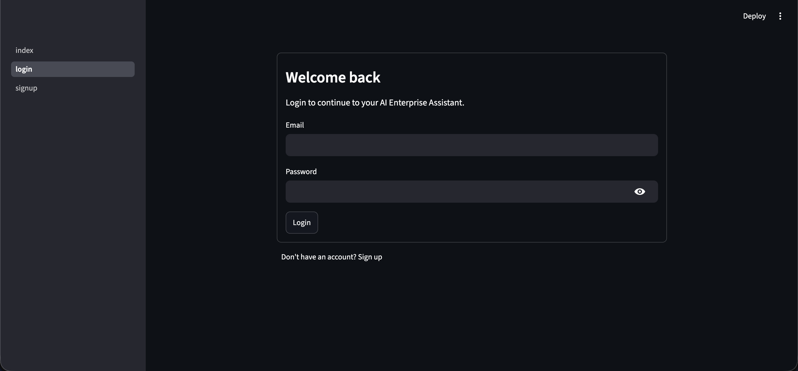
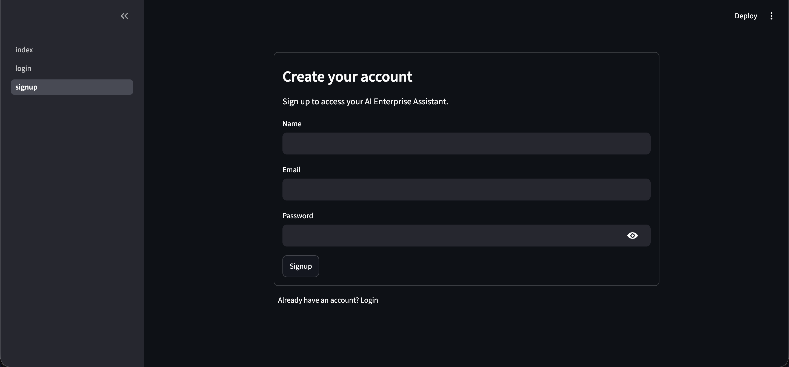
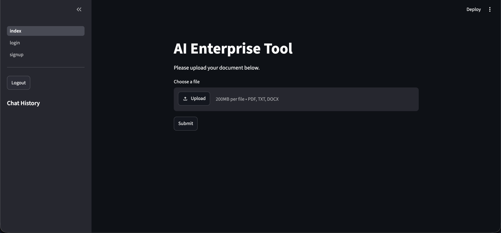
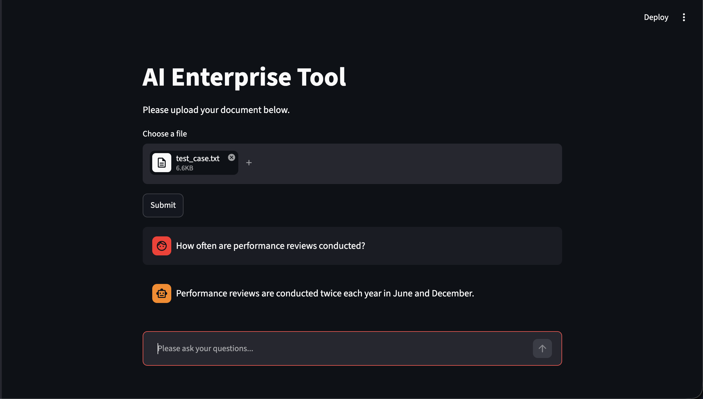
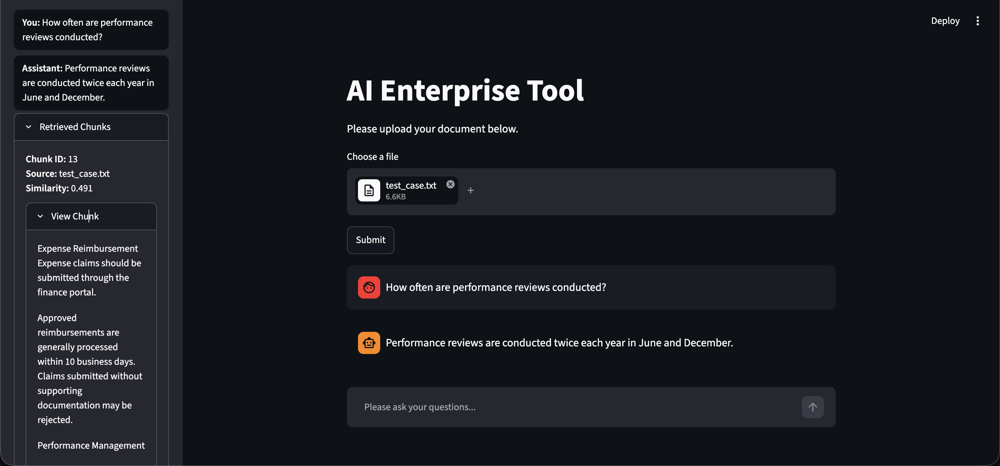

# AI Enterprise Support Agent

An enterprise-grade Retrieval-Augmented Generation (RAG) application that enables authenticated users to upload business documents and interact with them using natural language.

The application leverages **LangChain**, **LangGraph**, **FastAPI**, **ChromaDB**, and **Ollama** to provide accurate, context-aware responses with persistent chat history and source citations.

## Features

### Authentication

- JWT-based authentication
- User registration and login

### Document Processing

- Upload PDF, DOCX, and TXT documents
- Automatic text extraction
- SHA-256 based duplicate document detection
- Automatic text chunking
- Document metadata storage

### Retrieval-Augmented Generation (RAG)

- Semantic search using ChromaDB
- SentenceTransformer embeddings
- Context-aware answer generation
- Source citations with similarity scores

### LangGraph Workflow

- State-based workflow orchestration
- Graph-based execution instead of sequential pipelines
- Conditional routing
- State management
- Chat history persistence

### Database

- User management
- Document metadata
- Persistent chat history
- Conversation retrieval

### Frontend

- Streamlit conversational interface
- Document upload
- Source citation display
- Chat history sidebar
- Authentication UI

---

# System Architecture

```
                    ┌───────────────────────┐
                    │      Streamlit UI     │
                    └──────────┬────────────┘
                               │
                               ▼
                    ┌───────────────────────┐
                    │     FastAPI Backend   │
                    └──────────┬────────────┘
                               │
                 ┌─────────────┼─────────────┐
                 ▼             ▼             ▼
          Authentication   Document API   Chat API
                 │             │             │
                 ▼             ▼             ▼
           SQLite/Postgres   LangGraph    Chat History
                               │
                               ▼
                        Retrieval Pipeline
                               │
                               ▼
                           ChromaDB
                               │
                               ▼
                        SentenceTransformers
                               │
                               ▼
                           Ollama LLM
```

---

# LangGraph Workflow

```
                    User Question
                          │
                          ▼
                    Router Node
                          │
                          ▼
                  Retrieve Context
                          │
                          ▼
                  Generate Response
                          │
                          ▼
                 Save Chat History
                          │
                          ▼
                    Return Answer
```

---

# Project Structure

```
backend/
│
app-├── api/
    ├── db/
    ├── document/
    ├── graph/
    ├── models/
    ├── rag/
    ├── schemas/
    ├── services/
    ├── utils/
    └── main.py

frontend/
│
├── components/
├── pages/
├── services/
├── utils/
└── index.py

uploads/

data/

config.py
```

---

# Database Schema

## Users

| Column   | Description  |
| -------- | ------------ |
| id       | Primary Key  |
| name     | User name    |
| email    | Unique email |
| password | Password     |

---

## Documents

| Column        | Description       |
| ------------- | ----------------- |
| id            | Primary Key       |
| user_id       | Foreign Key       |
| file_hash     | SHA-256 hash      |
| original_name | Uploaded filename |
| stored_path   | Saved text path   |
| uploaded_at   | Upload timestamp  |

---

## Chat History

| Column      | Description         |
| ----------- | ------------------- |
| id          | Primary Key         |
| user_id     | Foreign Key         |
| document_id | Foreign Key         |
| role        | User / Assistant    |
| message     | Conversation text   |
| sources     | Sources of response |
| created_at  | Timestamp           |

---

# Tech Stack

## Backend

- FastAPI
- SQLAlchemy
- Pydantic
- JWT Authentication

## AI / LLM

- LangChain
- LangGraph
- Ollama
- SentenceTransformers

## Vector Database

- ChromaDB

## Database

- SQLite

## Frontend

- Streamlit

---

# API Endpoints

## Authentication

```
POST /signup
POST /login
```

## Documents

```
POST /upload
```

## Question/Answer

```
POST /ask
```

## Chat

```
GET  /chat-history/{document_id}
```

---

# Installation

## Clone Repository

```bash
git clone https://github.com/your-username/AI-Enterprise-Support-Agent.git

cd AI-Enterprise-Support-Agent
```

## Install Dependencies

```bash
pip install -r requirements.txt
```

## Run Backend

```bash
uvicorn backend.app.main:app --reload
```

## Run Frontend

```bash
streamlit run frontend/index.py
```

---

# Screenshots

## Login



---

## Signup



---

## Document Upload



---

## Chat Interface



---

## Source Citations



---

# Future Improvements

- Hybrid Retrieval (BM25 + Dense Retrieval)
- Tool Calling
- Calculator Tool
- Web Search Tool
- Multi-document RAG
- Docker Deployment
- AWS EC2 Deployment
- GitHub Actions CI/CD

---

# Author

**Arjun Jangid**

AI Engineer | Machine Learning | LLM | RAG | LangChain | LangGraph
